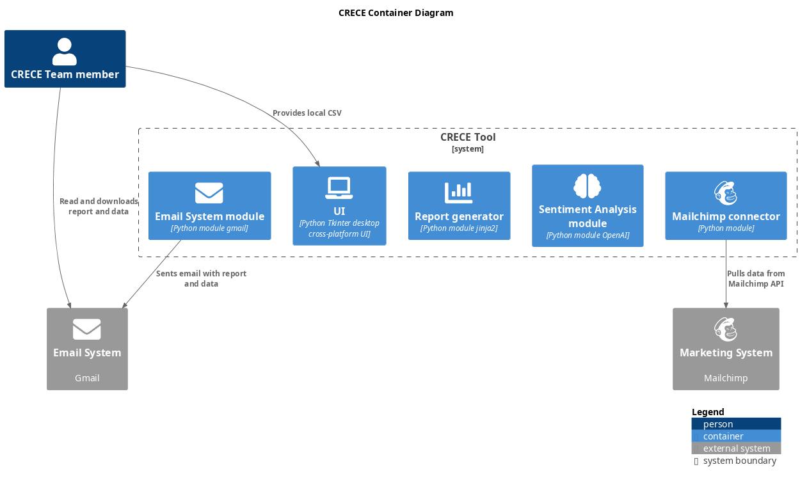
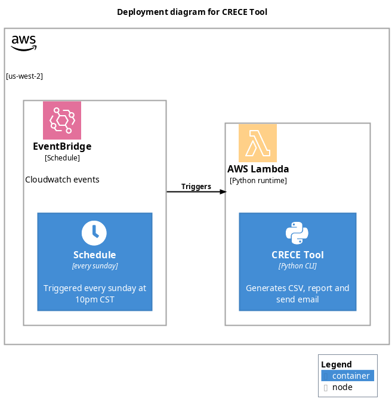

<h2>Table of Contents</h2>

<ul>
<li><a href="#orgheadline10">1. Requirements</a>
<ul>
<li><a href="#orgheadline1">1.1. Situation</a></li>
<li><a href="#orgheadline2">1.2. Task</a></li>
<li><a href="#orgheadline6">1.3. Action</a>
<ul>
<li><a href="#orgheadline3">1.3.1. Iteration 1</a></li>
<li><a href="#orgheadline4">1.3.2. Iteration 2</a></li>
<li><a href="#orgheadline5">1.3.3. Iteration 3</a></li>
</ul>
</li>
<li><a href="#orgheadline9">1.4. Results</a>
<ul>
<li><a href="#orgheadline7">1.4.1. Iteration 1</a></li>
<li><a href="#orgheadline8">1.4.2. Iteration 2</a></li>
</ul>
</li>
</ul>
</li>
<li><a href="#orgheadline13">2. Architecture</a>
<ul>
<li><a href="#orgheadline11">2.1. C4 Container Diagram</a></li>
<li><a href="#orgheadline12">2.2. C4 Deployment Diagram</a></li>
</ul>
</li>
<li><a href="#orgheadline14">3. TODO Backlog</a></li>
<li><a href="#orgheadline28">4. TODO Write GUI <code>[/]</code></a>
<ul>
<li>
<ul>
<li><a href="#orgheadline15">4.0.1. DONE Write Github Actions workflow to build app in Windows and macOs</a></li>
</ul>
</li>
<li><a href="#orgheadline21">4.1. TODO Write CLI <code>[0/4]</code></a>
<ul>
<li><a href="#orgheadline16">4.1.1. DONE Write mailchimp connector</a></li>
<li><a href="#orgheadline17">4.1.2. DONE Write reporting module using jinja2</a></li>
<li><a href="#orgheadline18">4.1.3. TODO Write sentiment analysis module POC with scikit</a></li>
<li><a href="#orgheadline20">4.1.4. TODO Write email system module</a></li>
</ul>
</li>
<li><a href="#orgheadline24">4.2. DONE MVP deployed in Github Action Runners <code>[2/2]</code></a>
<ul>
<li><a href="#orgheadline22">4.2.1. DONE Write Github Actions workflow to send email with github action</a></li>
<li><a href="#orgheadline23">4.2.2. DONE Write Github Actions workflow to trigger workflow weekly</a></li>
</ul>
</li>
<li><a href="#orgheadline27">4.3. TODO Lambda Function deployed in AWS <code>[0/3]</code></a>
<ul>
<li><a href="#orgheadline25">4.3.1. TODO Write terraform module of AWS Lambda and trigger</a></li>
<li><a href="#orgheadline26">4.3.2. TODO Write Github Actions workflow to deploy lambda</a></li>
</ul>
</li>
</ul>
</li>
</ul>

# Requirements

## Situation

CRECE team needs to retrieve emails from mailchimp list to identify new persons, locations and prayer requests so they can follow up during the week.
Current situation is they rotate team every week, one or two persons do following tasks:

-   If new person, must download Excel macro from drive, Google drive and Mailchimp credentials.
-   Log in into mailchimp CRECE account and manually download list.
-   Run macro and process data and upload new entries to shared spreadsheet in google drive.
-   Identify new persons and make a list of prayer requests.
-   Call those persons during the week and follow up with prayer requests.
    
    Problems are this has many security and privacy issue as sensitive data is shared with multiple people, including new members.
    Also some persons are not excel expert and have problem running excel macro.

## Task

Help them replace broken excel macro and make it user friendly, if possible automate full task and solve security and privacy issues without incurring into high costs.

## Action

### Iteration 1

First a Tkinter Python cross platform UI was created which replaced Excel macro, process still the same.

### Iteration 2

Second a architecture plan was proposed which includes a lambda triggered weekly which downloads more recent data from mailchimp, process it, creates a report and sends it to CRECE team email address.
Python CLI was extended from GUI code so it can download data from Mailchimp API, generate chart bar reports and sent report via Gmail. Solution is deployed on a Github Runner and triggered weekly.

### Iteration 3

A sentiment analysis is implemented to classify prayer requests into know categories, so prayer can be assigned to CRECE team members according to their expertise.

## Results

### Iteration 1

It was identified that some persons use a old version of Macos which can't run GUI. Also team members are not computer proficient and struggle to download and run the app.

### Iteration 2

Half process is automated and team has more time to focus on calling people. Also POC assured this solution generates no costs.

# Architecture

## C4 Container Diagram

## C4 Deployment Diagram

# TODO Backlog

# TODO Write GUI <code>[/]</code>

### DONE Write Github Actions workflow to build app in Windows and macOs

## TODO Write CLI <code>[0/4]</code>

### DONE Write mailchimp connector

### DONE Write reporting module using jinja2

### TODO Write sentiment analysis module POC with scikit

### TODO Write email system module

1.  TODO Create dataset and train SVC

## DONE MVP deployed in Github Action Runners <code>[2/2]</code>

### DONE Write Github Actions workflow to send email with github action

### DONE Write Github Actions workflow to trigger workflow weekly

## TODO Lambda Function deployed in AWS <code>[0/3]</code>

### TODO Write terraform module of AWS Lambda and trigger

### TODO Write Github Actions workflow to deploy lambda